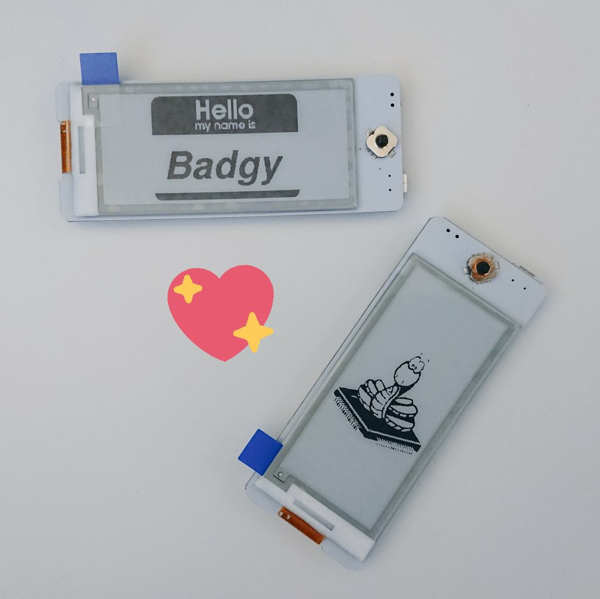

## Instructions
1. Follow this guide to install MicroPython on Badgy [Getting started with MicroPython on the ESP8266](https://docs.micropython.org/en/latest/esp8266/tutorial/intro.html)
2. Install [ampy](https://learn.adafruit.com/micropython-basics-load-files-and-run-code/install-ampy) or use the [WebREPL](https://micropython.org/webrepl/) for uploading files
3. Upload [main.py](main.py), [image.py](image.py), and [epaper2in9.py](epaper2in9.py)
4. Reset Badgy and see the image!

## Next Steps
* Check out this [library](https://github.com/mcauser/micropython-waveshare-epaper) by [@mcauser](https://github.com/mcauser) for more examples and function calls
* We'll be adding more examples shortly!
